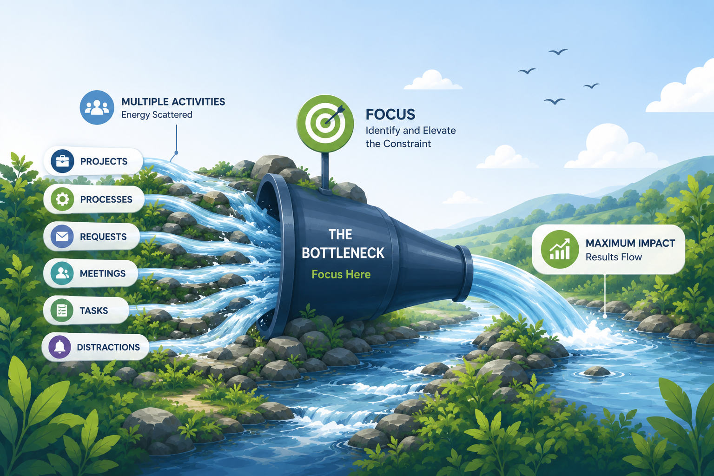

# Business Focus

At their core, all businesses—regardless of industry or scale—face the same fundamental challenges:

- **Customer Acquisition:** How do we attract and win new customers?
- **Customer Retention and Service:** How do we maintain relationships, communicate effectively, and meet evolving customer needs?
- **Robust Infrastructure:** How do we ensure secure and efficient data flow throughout the organization?
- **Billing :** How do we get paid?

If a business intends not just to survive, but to decisively outperform the competition—rather than becoming an overstaffed social safety net for unnecessary 'white-collar knowledge workers'—it must rigorously apply the [Theory of Constraints](/system/toc). This framework enables organizations to systematically identify and eliminate bottlenecks, unlocking true operational efficiency.

This approach was instrumental in the transformation of iNTERFACEWARE. Initially, the process was daunting; we identified that the single greatest constraint to our organizational efficiency was our bloated workforce. The solution was radical: eliminate every unnecessary position and rebuild the business from the ground up.

Today, iNTERFACEWARE operates with an unconventional structure—without any traditional employees. Eliot Muir functions as a sole proprietor, collaborating with a lean, high-performance network of trusted partners and like-minded individuals. The core team comprises just four people, sufficient to ensure redundancy in support, while development is managed solely by Eliot, leveraging advanced automation and AI for consistency and efficiency.

The company operates with a zero-trust security model. Each core contributor is fully accountable for their own infrastructure, minimizing overhead through strategic technology choices and intelligent design.

Eliot consults for a select clientele—only engaging with those who have the drive and mindset to dominate their markets. His philosophy is unwavering: eliminate unnecessary complexity, maintain relentless focus, and always adhere to the [Theory of Constraints](/system/toc).

This is not just a more efficient way to do business—it is a demonstrably more profitable one. Today, we are on track to achieve over three times the net profit after tax compared to our previous structure.  Eliot runs the business out of his home in the Cayman Islands.

