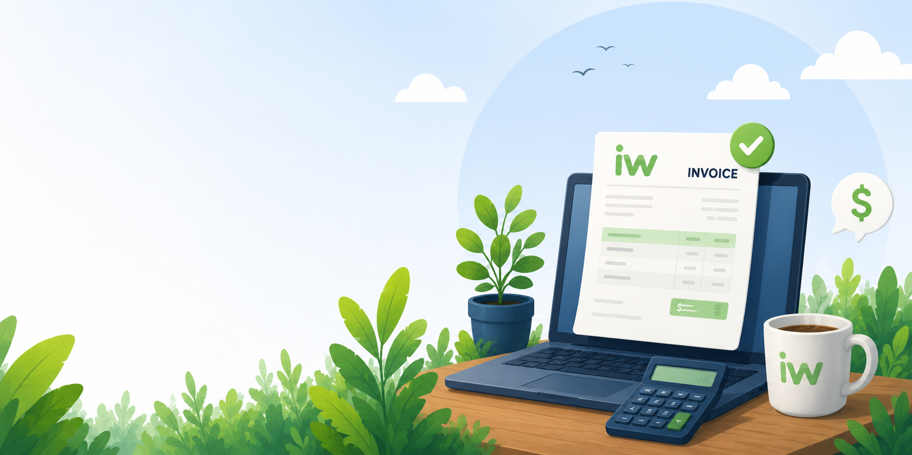

# Business 

We’re making some improvements to simplify how we manage billing and licensing at iNTERFACEWARE.

[Paul Gannon](/people/paul) is leading this transition, and customers will be moved gradually to the new process.

Our goal is simple: make it easier to do business with us by standardizing our commercial terms, simplifying license management, and reducing unnecessary administration.

We remain fully committed to supporting and developing both Iguana 6 and Iguana X. Both are important, reliable products that our customers depend on every day.

These changes allow us to focus on what matters most: **reliable software, responsive support, and long-term sustainability**.
