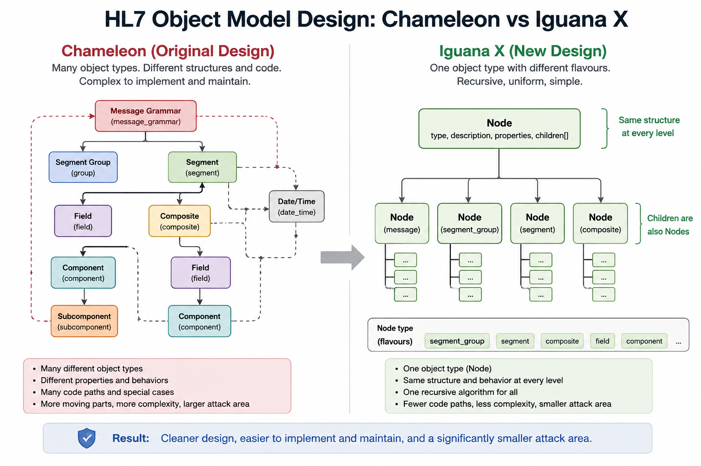

# Future

Finding a smooth migration for our customers with Chameleon is one of
iW's top priorities. Our plan is to port backwards the HL7 grammar system
that was shipped with Iguana X.

The fundamental difference between the original Chameleon HL7 model and the later Iguana X model is not XML versus JSON. It is the underlying abstraction.

Chameleon models the different levels of HL7 using different kinds of objects. Messages, message grammar, segment groups, segments, fields, composites and date/time values each have their own representations and their own associated machinery.

That seems natural at first because these things have different names and different purposes in the HL7 specification. The problem is that structurally they are variations of the same idea: HL7 is a recursive hierarchy.

Every time the Chameleon model crosses from one level to another, the implementation has to cross between different abstractions. That leads to a combinatorial growth in special-case code for parsing, validation, navigation, repetition, editing and serialization.

## The Iguana X HL7 grammar takes a much simpler approach.

Messages, segment groups, segments and composites are all represented using essentially the same kind of node. A node has a type, a description and, where appropriate, a collection of children. The different levels of HL7 are simply different flavours of that same object.

This means the software model mirrors the structure of HL7 itself.

Instead of writing separate machinery for every layer of the protocol, the same recursive algorithms can operate throughout the grammar. A message contains nodes; those nodes contain nodes; and the same machinery continues down through the hierarchy.

That is why the Iguana X representation is dramatically simpler.

The lesson from Chameleon was not that HL7 itself had to be complicated. Much of the complexity came from our original choice of abstractions.

Once we recognized that HL7 is fundamentally recursive and represented it recursively, a large amount of accidental complexity simply disappeared.

