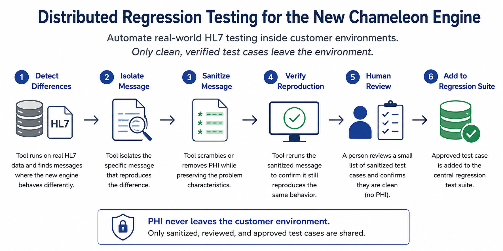

# Testing

**Distributed Regression Testing for the New Chameleon Engine**

The real economic opportunity lies in creating a **distributed regression-testing system** for the new Chameleon engine—one that automates work traditionally requiring extensive, expensive, and time-consuming effort by site engineers.

By shifting to this model, a migration effort that might have cost millions across many sites would then be accomplished at a fraction of the expense and time.

The most valuable HL7 test data resides in real customer environments, containing years of unusual variations and edge cases. Manually identifying and extracting meaningful regression cases from this data would demand significant technical effort at each site. Furthermore, this data cannot simply be collected centrally due to the presence of PHI (Protected Health Information).

Instead, the ideal tool would run within each customer environment. It would process authentic HL7 data through the new Chameleon engine, identify the few cases that behave differently, isolate those messages, scramble the PHI, and confirm that the sanitized messages still reproduce the same behaviors.

At this point, a person only needs to review and approve a small set of sanitized test cases before they leave the customer environment. **Importantly, that person doesn’t need to understand Chameleon or diagnose technical problems.** Their sole responsibility is to verify that the outgoing messages are clean and free of PHI.

The workflow looks like this:

**real-world HL7 → detect differences → isolate → sanitize → verify → human privacy review → regression tests**

This approach transforms the economics of migration. Instead of relying on skilled engineers to investigate, sanitize, reproduce, document, and communicate individual issues, the software automates nearly all technical tasks. The remaining human effort is minimal, straightforward, and privacy-focused—something that could be performed by a non-engineer.

As a result, it becomes economically feasible to test the new Chameleon engine against the immense diversity of HL7 encountered in real production environments. Every participating site becomes part of a **distributed regression-testing network**, all while keeping the customer in control of the information that leaves their environment.

Each useful exception can then become a permanent regression test, progressively strengthening the new Chameleon engine as it embraces more of the real world.

This really important for critical infra-structure software.
