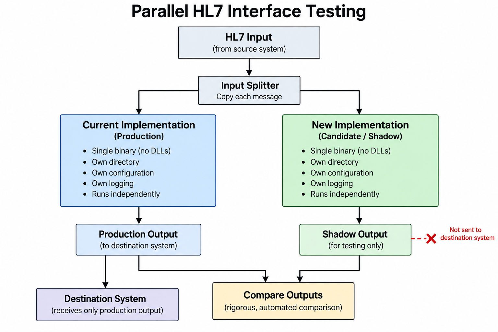

# Parallel

**Running new HL7 implementations in isolation and in parallel is the key to reducing the cost and risk of interface maintenance.**

## This matters especially when 'just patching' security holes.

When dealing with old code bases, change must be approached very conservatively, with careful preparation and thought. It's very risky, both in terms of production impact and reputational risk, to assume that even 'patching' an implementation which hasn't been touched for years can be done safely.

## So how do you do this safely?

How does the healthcare industry bring down the cost of maintaining HL7 interfaces, while still making it practical to improve the underlying technology and keep it compliant with evolving security standards?

End customers should not need to be involved every time the underlying HL7 implementation changes. The testing of a new implementation should be rigorous enough that it can run in parallel with the existing production interface, without interfering with it.

Even when simply patching an existing implementation, it should be possible to run the patched version alongside the current version using an architecture like this:

* Each implementation should preferably be packaged as a single binary, without DLL (shared library) dependencies. With Iguana X, we found that Windows crash support required us to include the Windows debug binaries in the deployment package, but the principle is to minimize external dependencies. At least put them in the same directory and *never* alter the PATH.
* The binary, its dependencies, and configuration should be self-contained. The deployment could also be cryptographically signed so that it cannot be tampered with.
* Each implementation should have its own directory, configuration, and logging. Runtime logs should be uniquely associated with that implementation.
* The new implementation should not interfere in any way with the existing production implementation.
* The input feed should be split so that exactly the same HL7 messages are fed to both implementations.
* The existing implementation remains authoritative and continues to produce the real production output. The output from the new implementation is captured only for testing and is never sent to the destination system.
* The outputs from both implementations can then be rigorously measured and compared.

This gives us a very simple progression:

**isolate → duplicate the input → run both implementations → compare the outputs → establish equivalence → promote**

A security patch can therefore be tested this way; so can a new version of Chameleon. Eventually, an entirely different implementation can be tested in exactly the same way.

And that is really the point: this architecture should not be specific to Chameleon, Iguana, or any particular technology.

If the inputs and outputs define the contract, then the implementation inside the black box should be replaceable.

That is what makes it possible to modernize HL7 infrastructure incrementally, while containing both the cost and the risk of change.

