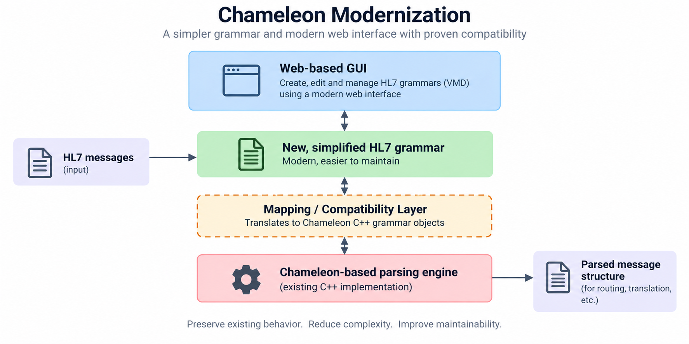

# Compatibility

**Approach to Chameleon Compatibility**

We are exploring a compatibility layer that connects our new, simplified HL7 grammar with the existing Chameleon-based parsing engine. 

The goal is simple: **update the core technology without disrupting interfaces that already work reliably in production.**

In this model, the new simple HL7 grammar is mapped to existing Chameleon grammar objects. This gives a path to modernizing the UI while preserving current parsing behaviors.

A key benefit is that we can regression test at customer sites using existing VMD files, interfaces, and data. Since HL7 interfaces are often highly customized, only real-world testing can reveal issues. Comparing old and new systems side-by-side helps identify any differences.

That would give a modern, web-based graphical interface for working with these grammars enabling easy integration with both Iguana 6 and Iguana X.

This approach keeps the Chameleon parsing behavior where needed, even if it’s not how we would build things from scratch today. There’s no benefit to changing stable, proven systems without cause.

At the same time, customers can gradually transition to the much simpler HL7 grammar and architecture. This makes the system easier to understand, test, maintain, and secure.

Our guiding principle: **ensure compatibility without being locked into old systems**. We want to maintain proven performance while replacing the underlying technology and user interface with something modern and maintainable.

This is one of several options we’re considering. Our focus is on careful regression testing and step-by-step change, not forcing unnecessary migrations for functioning customer interfaces given the magnitude of interfaces that customers have to support.
