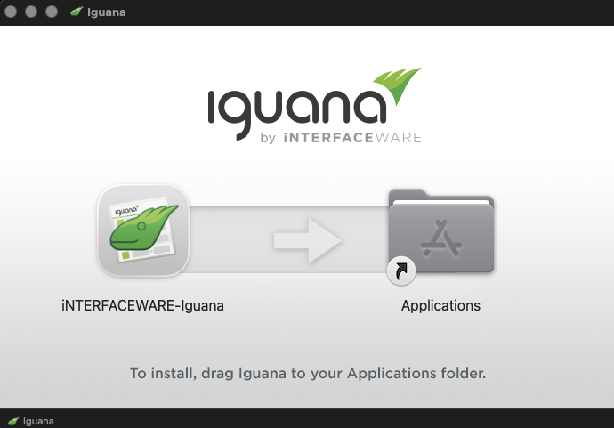

# DMG

**A DMG is a Disc ImaGe which how traditionally applications have been installed on Apple computers.**

This is where you get the experience with installing MacOS applications the traditional way:

Getting the DMG process to create the Installer for macOS reminded me why I am personally very careful about using rapid development technologies with many dependencies.

The process was done with Python, which isn’t the approach I would have chosen myself, but I took the necessary steps to make it work. Eventually, the plan is to come back and simplify it by adopting the same process I use for the Iguana X Mac installer, so that we have a single, unified method.

This is part of the ongoing process of simplification that needs to happen to quietly make both products easier to maintain and to harmonize their workflows.

