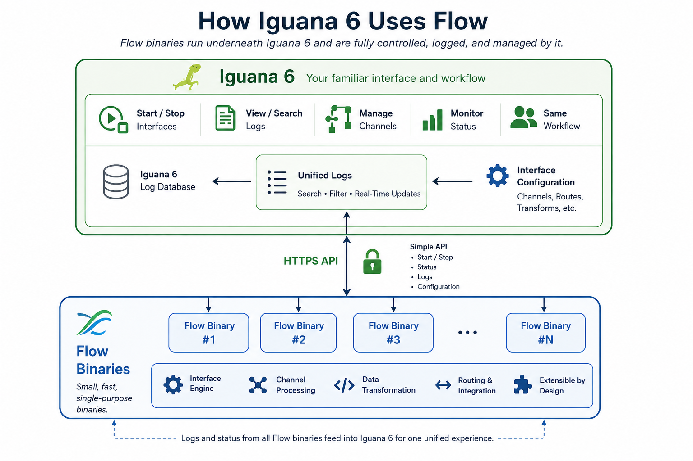

# Integrate

# A Safe, Incremental Path from Iguana 6 to Flow

One of the biggest challenges in healthcare integration is that success creates risk.

Once an Iguana 6 installation becomes part of a hospital’s or organization’s critical infrastructure, customers—quite rightly—become very conservative. The software is stable, proven, and deeply integrated into their business processes. Any major upgrade introduces risk, so many customers deliberately avoid adopting new versions until they have been extensively proven in production.

Flow, however, takes a fundamentally different approach.

Instead of asking customers to replace their integration engine, Flow allows them to introduce new technology one interface at a time. Each Flow binary performs a single, well-defined task while Iguana 6 continues to do what it already does extremely well: scheduling, monitoring, logging, searching, alerting, and managing production interfaces.

This dramatically reduces deployment risk. Each Flow component can be tested, validated, and rolled back independently without affecting the rest of the production environment.

## Solving Problems Outside Iguana's Core

The first Flow binaries are intended to solve problems that are awkward or risky to address within Iguana itself.

For example, Oracle client libraries have a long history of introducing instability into applications. Rather than loading those libraries directly into the Iguana process, a dedicated Flow binary can isolate Oracle interactions. If Oracle misbehaves, the problem is contained within that single component, rather than threatening the entire integration engine.

Windows file sharing is another example. Accessing Windows shares often requires complicated service account configurations and permissions. A small Flow binary running with the appropriate credentials can expose a simple HTTP API, allowing Iguana to interact with Windows shares without embedding that complexity into the engine itself.

## Isolation Improves Reliability

The philosophy is simple:

* Keep Iguana stable.
* Move specialized or higher-risk functionality into isolated Flow binaries.
* Communicate using simple HTTP interfaces.
* Test each component independently.
* Deploy gradually as confidence grows.

Because each Flow binary is a separate process, failures remain localized. The core Iguana environment continues running, even if a particular external technology encounters problems.

## Building Confidence Over Time

The migration is intentionally conservative.

Initially, only a handful of customers will deploy Flow, focusing on problems where Iguana has limited native support or where isolation provides immediate operational benefits.

As more Flow binaries prove themselves in production, customers will naturally become comfortable with the architecture. They gain the flexibility and transparency of open-source Flow technology without risking the stability of their existing Iguana installations.

Rather than replacing Iguana overnight, Flow extends it.

Customers continue to rely on the proven operational experience they already trust, while gradually adopting modern, inspectable, open-source components exactly where they provide the greatest value.

The result is not a disruptive migration—it is a carefully managed evolution that minimizes operational risk while steadily expanding what Iguana can do.

