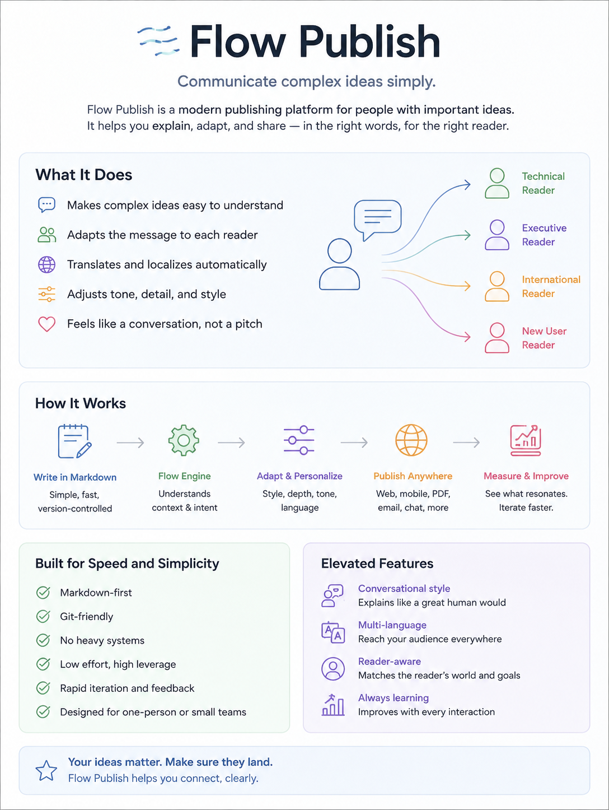

## Built with Flow Publish

This website is powered by an early prototype of Flow Publish. If you've been following our journey, you already know just how powerful this platform is becoming. Flow Publish enables us to update and adapt the website overnight, instantly responding to customer feedback and making real-time improvements.

## Personalized Experience

Every visitor is uniquely identified, allowing us to deliver a completely custom experience tailored to each individual. With Flow Publish, your browsing experience is as unique as you are.

## Simple and Mobile-Friendly

Unlike other publishing platforms, Flow Publish empowers authors to focus on their content instead of wrestling with complicated technology. The result? Effortless communication and a seamless user experience—whether you're browsing on desktop or mobile, everything just works.

## Seamless AI Integration

Flow Publish integrates perfectly with AI tools, making grammar and fact-checking easy and efficient. Your content stays accurate, polished, and up to date, every time you hit publish.

## Eliot’s Journey — Less Stress, Fuller Hair

Since switching to Flow Publish, Eliot has been losing less hair. The effortless workflow and instant updates mean less frustration and more time for creativity. Thanks to Flow Publish, website management doesn’t have to be a headache!

