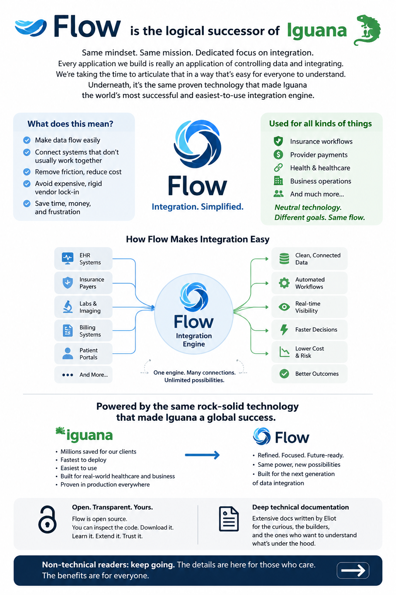

# Flow

## Flow is the logical successor to Iguana

The idea is to take the best of Iguana 6 technology, combine it with some of the better ideas from Iguana X, and build a platform that is even more dependable, flexible and faster than Iguana 6.

## Flow is open source

Flow is being developed as open source technology. It is actually much more versatile than what Iguana itself could do.

## Flow is based on the same core technologies as Iguana

C++, Lua, and Git are combined to create a robust platform. Customers can view both the C++ and Lua code, and the platform encourages them to learn both. This means there are no limits to what can be done with this technology.

## What is the migration path?

Flow needs to mature first, but the technology is essentially delivered as small, cross-platform binaries which can be monitored and controlled by Iguana 6.

It addresses a major problem with Iguana 6 upgrades: upgrading was always extremely risky. An upgrade consisted of changing every interface at once, which was absolute lunacy in an enterprise environment.

No sane customer would ever want to do that, and it's not surprising given the risk involved.

## Flow technology eliminates that risk

Each interface is no longer part of the same process. Instead, Flow applications are always delivered as a single binary that works on any operating system. That binary exposes a standards-based HTTPS interface to Iguana 6, allowing the Flow binary to be seamlessly controlled and logged via the same mechanisms as other Iguana channels. This means interfaces can be upgraded one by one, rather than putting the entire set of interfaces at risk with a single upgrade.

## The ultimate solution

Once a customer has fully migrated to Flow-based interfaces, we’ll provide a replacement dashboard and logging technology with which Flow binaries can integrate.

It all adds up to a much more robust and resilient architecture.

## It solves many problems caused by bad technology

Oracle drivers, for instance, are notorious for crashing the applications that use them. With Flow, the overall interface engine is never exposed to an Oracle driver—instead, only the Flow binary is exposed.

The same goes for dangerously insecure technologies like HTTP/2, which we jokingly refer to as the "Spyware" edition of HTTP because it’s so complicated and has so many security vulnerabilities. In this way, clients who have no choice but to deal with these legacy technologies can at least contain their exposure—preferably on machines that run these technologies in a contained manner, thus insulating the overall environment from these risks.

## Will everything be open source?

No. Some parts of the technology will need to remain closed source for the practical reason that we actually want customers who will pay us money. Eliot did some early experiments during the initial restructuring and figured out that it's important to have some parts of your intellectual property that you hold back and sell for money.

For Flow, that will be the dashboard and logging system that will eventually replace Iguana 6. It will be a very nice product and provide a natural, safe migration path for users of Iguana 6.

## Why would I pay?

Well, it's generally unwise not to have technical support for a product that is part of your critical infrastructure. Also, because the Flow technology will evolve and grow, it generally helps to have a relationship that enables you, as a customer, to understand where the good versions of things are.

That is pretty much how open source works. A lot of people who don't have terribly serious problems use the free stuff, but when you are dealing with something that is mission critical, you'd be pretty unwise not to pay for support—to make sure the software stays in a form that meets your needs.

Overall, this is a good compromise between commercial realities, while still making things open enough to guarantee long-term safety for users and iNTERFACEWARE alike.

