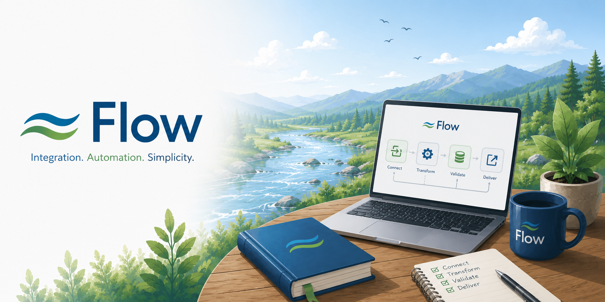

## Flow is a Bigger Idea than Iguana

If we are building new technology, why create something that solves the same problem as Iguana? Flow is a much bigger idea. It’s the foundation of a technology that will allow our customers and affiliates to tackle really big, really important problems—the kinds of constraints that limit growth.

Flow is the very embodiment of the [Theory of Constraints](/system/toc) expressed in software.

## Flow is Open Source

Flow is being developed as open source technology. It has to be this way—otherwise, customers would have no way to eliminate key bottlenecks that could prevent them from implementing the Theory of Constraints.

Flow solves the issue found in most closed-source vendor solutions, which often become dead ends. Customers eventually encounter bottlenecks due to missing functionality in the vendor’s product, with no way to resolve them.

## Flow is Based on the Same Core Technologies as Iguana

C++, Lua, and Git are combined to create a robust platform. Customers can access both the C++ and Lua code, and the platform encourages them to learn both. This means there are no limits to what can be achieved with this technology.

Flow can do things that would be inconceivable with Iguana. Iguana was a great product, but it limited customers to coding only in Lua. With Flow, you can extend your codebase using a low-level systems language like C++, making Flow much more powerful.

## What is the Migration Path?

Flow needs to mature first, but the technology is essentially delivered as small, cross-platform binaries which can be monitored and controlled by Iguana 6.

This addresses a major problem with Iguana 6 upgrades: upgrading was always extremely risky, as it involved changing every interface at once—an approach that is absolutely inadvisable in an enterprise environment.

No sane customer would want to do that, and the risk involved was significant.

## Flow Technology Eliminates That Risk

Each interface is no longer part of the same process. Instead, Flow applications are always delivered as a single binary that works on any operating system. That binary exposes a standards-based HTTPS interface to Iguana 6, allowing the Flow binary to be seamlessly controlled and logged through the same mechanisms as other Iguana channels. This means interfaces can now be upgraded one by one, rather than risking the entire set of interfaces with a single, sweeping upgrade.

## The Ultimate Solution

Once a customer has fully migrated to Flow-based interfaces, we’ll provide a replacement dashboard and logging technology that Flow binaries can integrate with.

It all adds up to a much more robust and resilient architecture.

## Solving Problems Created by Bad Technology

Oracle drivers, for instance, are notorious for crashing the applications that use them. With Flow, the overall interface engine is never exposed to an Oracle driver—instead, only the Flow binary is.

The same goes for dangerously insecure technologies like HTTP/2, which we jokingly refer to as the “Spyware” edition of HTTP because it is so complicated and riddled with security vulnerabilities. This way, clients who have no choice but to work with these legacy technologies can at least contain their exposure—ideally on isolated machines—thus insulating the overall environment from these risks.

## Will Everything Be Open Source?

No. Some parts of the technology will need to remain closed source for the practical reason that we actually want customers who will pay us. During the early restructuring, Eliot ran some experiments and realized it’s important to retain certain parts of our intellectual property and offer them as paid products.

For Flow, that will be the dashboard and logging system that will eventually replace Iguana 6. It will be a high-quality product and provide a natural, safe migration path for Iguana 6 users.

## Why Would I Pay?

It’s generally unwise to operate critical infrastructure without technical support. Additionally, as Flow technology evolves and grows, it’s helpful to have a relationship that allows you—as a customer—to understand which versions are stable and well-supported.

That’s essentially how open source works. Many users with less critical needs use the free version, but for something mission-critical, it’s wise to pay for support—to ensure your software remains reliable and up to date.

Overall, this approach strikes a good balance between commercial realities and openness, guaranteeing long-term safety for users and for iNTERFACEWARE alike

