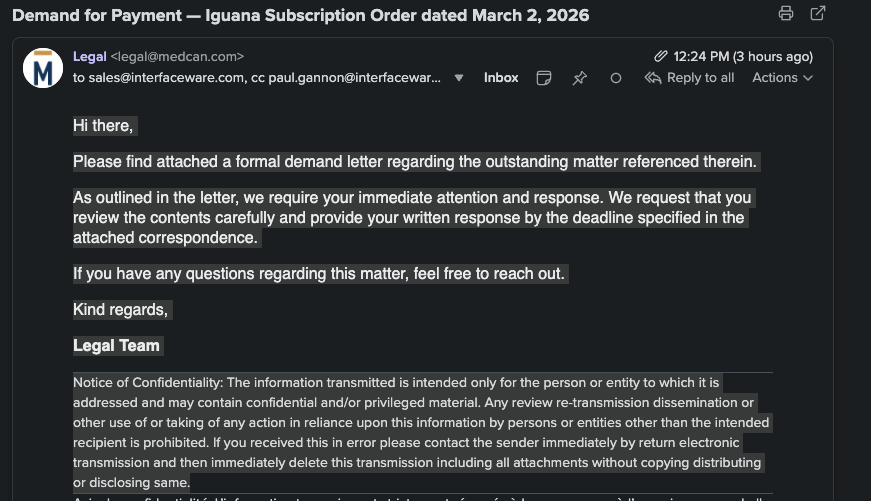

# Anonymous - LEGAL@MEDCAN.COM

**This page was automatically generated for [legal@medcan.com](mailto:legal@medcan.com) using [Flow Protect](/flow/protect).**

For more information see [anonymous](../anonymous).

You have reached this page because an email originating from an anonymous "team" address was detected. This is often indicative of organizational dysfunction, as a lack of individual accountability can undermine trust and efficiency.

It is recommended that such practices be addressed, and that you consider reevaluating the roles of employees who choose to operate anonymously and avoid direct responsibility.

Part of the weighting is that your organization has already been flagged as an IT organization that has excessive bureaucracy.

**Please note:** This is an automated action. If you have been sent here, it is due to the anonymous nature of your correspondence. Accountability is a key trait among market leaders, as outlined in [markets consolidate down to two](/system/two/market).

If you prefer anonymity, a career in government may be more aligned with your professional style. Let us help you make that transition by relieving you of your current employment.

This information has already been sent to your CEO via a fully automated workflow using [Flow Communicate](/flow/communicate).

[Flow Protect](/flow/protect) has assessed that your [CEO Shaun Francis](https://www.linkedin.com/in/shauncfrancis) is a believer in free market principles via his involvement in the Fraser Institute. 

Therefore he will strongly identify with [Eliot Muir our Founder and CEO who also deeply believes in the free market](https://www.linkedin.com/in/eliotmuir/).

Therefore, he is likely to realize that the cost savings from downsizing your team to one person could, in fact, be a worthwhile exercise.

This procedure reflects our new brand principle at **iw**: **less is more**.

See [Staff](/system/remove/staff) for more thoughts on how your organization can be streamlined.  Probably not to the same degree. But your administration could be greatly simplified.  You are in effect free riding off the hard effort your founder has put into creating your organization.

If you believe this notification has been issued in error or should be removed, please contact a human representative at iNTERFACEWARE using verified and direct communication methods. Identification will be required to proceed. This will require the use of modern communication technologies such as iMessage or WhatsApp. This will quickly be used to facilitate a ZOOM conversation. You'll need to have a government ID, such as a driver's license, passport, or health card, to verify your identity.
