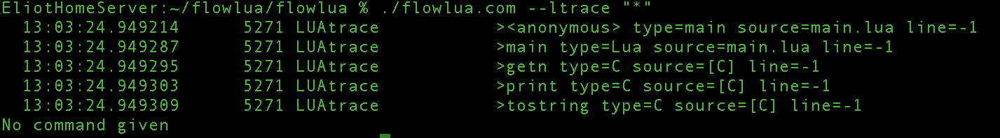

# Flow

## Focus for Today – Rearranging the Site to Preserve Mental Health

So far, in all my conversations with customers, we’ve reached the same conclusion.

Iguana 6 is good enough—please focus on making Flow the foundation that can replace it.

Also, could we hear a little less about social issues? We get it. These issues are real, but they are disturbing us, and we need better boundaries for the sake of our mental health.

I’ve confirmed with my customers, and the main request I’ve heard loud and clear from you is: while the thoughtful among you understand the issues I’ve raised are real, you don’t want to engage with them every day. It’s the stuff of nightmares, and frankly, it’s not good for anyone’s mental health—mine included.

Today, my focus is on maturing Flow, which will now replace FlowShell and FlowLua, and turning it into a tool that will allow me to rearrange the website—making the social topics I discuss less prevalent.

I also hope to add the beginning of Lua tracing. This will be similar to what the translator does, but much more powerful, providing a tool for writing and running substantial code in Lua.

It’s all about control and visibility.

## Installation Instructions

To install it, go here for instructions:

[Explore FlowLua on GitHub](https://github.com/eliotmuirgrid/flowlua)

Compilation is currently only supported on Linux and Mac, but the cool thing is the same binary works on all operating systems because it uses Cosmopolitan.

This tool is command-line oriented.

The command line isn’t bad—it’s just historically cluttered, with countless tools and inconsistent conventions that make it hard to learn and remember.

I started working on **FlowShell** even before my radical business restructuring.  
Automation is essential. I started with zsh and gradually built small abstractions whenever I forgot commands or had to repeat tasks. These improvements grew into **FlowShell**—a tool designed to make Unix easier, not to replace it (except that, eventually, it will become something different from Unix).

FlowShell is intended to guide users toward their goals without requiring them to memorize arcane command syntax. Before releasing it widely, I'll clean up my personal shortcuts to ensure a streamlined, reusable tool. I haven’t done that yet—it’s still messy!

FlowShell was prototyped in an obscure language called zsh. Don’t worry about it—I’m porting everything over to Lua, and then we can forget about zsh.

[Explore FlowShell on GitHub](https://github.com/eliotmuirgrid/flowshell)

## A tiny beginning of something big.

The first screen shot of seeing Lua tracing in action.  It's rough but 
it's a beginning.  And I will make it better.  Big things start small.  This
is how ordinary humans will take control of their own data.

## Chilling Update on the Subrina Situation

The penny dropped for me yesterday, and Subrina—or someone using her WhatsApp account—confirmed it... I don’t know what is true anymore. But when you have a generation of young people who got their sex education from Pornhub, where 99.9% of the content is about “families” having sex together, the chilling reality sinks in.

We are dealing with a **systemic problem for society as a whole**. Shoot me and put me out of my misery. How on earth did we let this happen as a society? We’re all too busy looking at imagined risks and ignoring the very real things happening right under our noses. What the hell! At this stage, it appears that Subrina may in fact be a willing, and probably at times enthusiastic, participant in “family fun times.”

I think I'll keep a low profile until this little storm blows over.

How did society get so dark? I think of my own kids—Rhy Muir and Alice Muir—and it’s pretty damned obvious what the possibilities are. We gave our children all the tools they needed to educate themselves to be porn stars from the moment they could operate a web browser. Perhaps we should have made better choices?

I thought it was cool that my eldest, Liam Muir, taught himself to read off a website by age four. I had no idea what fuse had been lit. Holy crap!

This was the begining when I realized the existential challanges we face - dark times call for unconventional leadership.

I am that leader.
