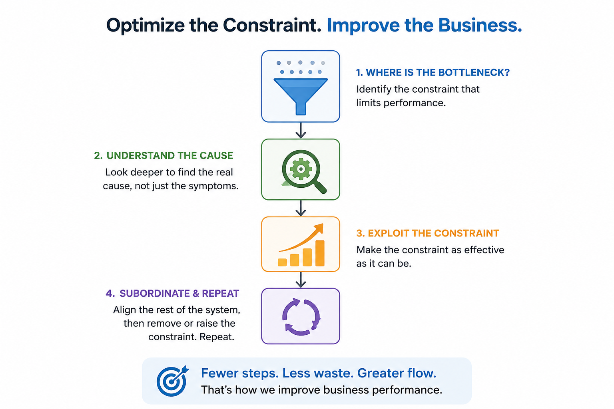

# iNTERFACEWARE – Integration That Improves Business Performance

We help organizations identify and remove operational bottlenecks using the [Theory of Constraints](/system/toc). The goal isn't integration for its own sake—it's measurable business improvement.

Complexity is the enemy of performance. Often the fastest way to improve a business isn't to add more technology, but to [remove processes, systems, and solutions](/system/remove) that no longer create value. Think of it as decluttering your business.

We challenge conventional thinking, using simple analogies to explain complex ideas. Sometimes the right answer is uncomfortable—but meaningful improvement rarely comes from doing what everyone else does.

We value substance over appearance. This website is intentionally simple because clarity matters more than polish.

## Built on Iguana. Moving Forward with Flow.

Iguana 6 remains the foundation of our production business. It's future, however, is [Flow](/flow): a platform designed to optimize not only integration, but the way software is designed, built, and improved.

We're applying Flow to our own business first, refining it through real-world use before introducing it to customers. We believe the best way to prove technology is to rely on it ourselves.

Businesses that consistently outperform their competitors don't optimize everything—they [optimize the constraint](/system/toc/bottleneck). That's the philosophy behind everything we build.

## Main Resources

- [Product Documentation](documentation.md)
- [Information on how to get support](support.md). Unfortunately, email communication has degraded, so we encourage other forms of communication.
- [Get license codes right here.](license.md)
- [Product Downloads](downloads.md)
- [Billing processes are being optimized.](billing.md)
- [Chameleon Customers: Please note, Secure Sockets will be mandatory in 2026](/documentation/chameleon/security)

This website is built with [Flow Publish](/flow/publish), the first application of the Flow platform. It also represents the first step in the [long-term evolution of Iguana 6, allowing customers to adopt new technology gradually and safely](/flow/aiguana).

Our mission hasn't changed:

Help customers **control their data**.

Enjoy,

**Eliot Muir**  
**CEO/Founder of iNTERFACEWARE**  
**Architect of Iguana**  

