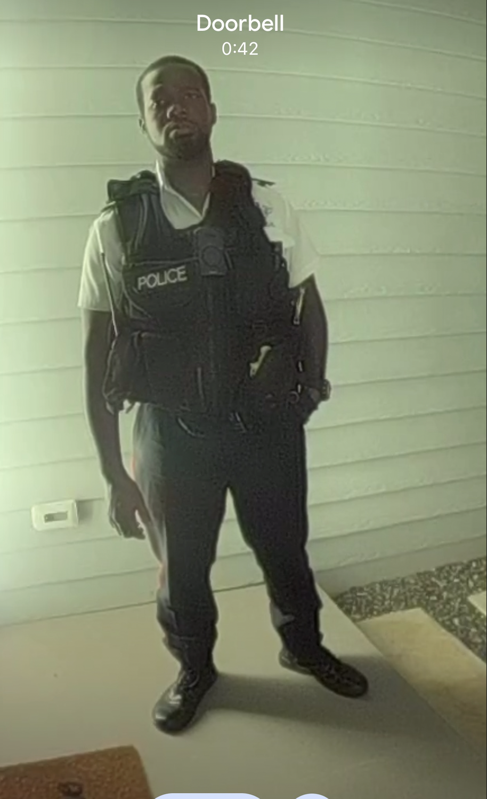

# Officer Price, Badge 826

Officer Price this information might be wildly inaccurate feel free to ask a more
intelligent friend on how to [fork](fork.md) this website and correct the mis-information.

I’ve always been fascinated by the inner workings of the police department, especially when it comes to how complex situations can sometimes trip up even the best-intentioned officers. As it happens, I actually know quite a few people in law enforcement. Officer Price could easily connect with
[Mikhail MK](mk.md) who is a member of the a group of Caymanians who would rather
do anything but their extremely boring jobs.

I still wish you would showed a bit more enthusiasm for investigating what happened to [Subrina](subrina.md) rather than making me feel naughty for asking [Kwaine Reid](kwaine.md) her brother awkward questions.

The problem with most rape and incest cases is the victim seldom wants 
prosecute their family.  Despite everything they love them. Weird eh?

Unfortunately it looks like I am in more trouble - shrug. I don't think I should be in trouble? I didn't rape anyone.

**Officer Price, Badge 826**—whose full name I never quite caught—seemed very focused on upholding protocol, and sometimes the approach is a reminder that the law’s priorities might not always line up with the expectations of the community, especially in sensitive situations. My cousin Tim once worked as a prison officer, specifically dealing with the care of sex offenders, and it's eye-opening to see how many layers there are to protecting people in our justice system.

I do believe **Officer Price** is an honourable man with his own sense of integrity, striving to navigate a system that can be challenging and imperfect, especially when it comes to supporting and protecting victims. So, thank you, **Officer Price 826**, for your service under difficult circumstances. I imagine your family must be proud of your commitment.

It does seem, however, that unless victims of abuse can provide evidence immediately (which is rarely possible, especially for children), justice remains an uphill battle. I hope that in the future, the law can grow more supportive and accessible for those who need it most.

In reality there is little point in dragging offenders through the justice system - it doesn't really provide healing.  Families do need to reconcile and move on.

All that said, I look forward to feeling safe and at ease again—then I’ll be more than ready to help with customer problems, rather than police problems!

Officer Price would like to have a conversation - I do too!  But I am just a little particular about the [boundaries of that conversation](/incest/police/serious).

