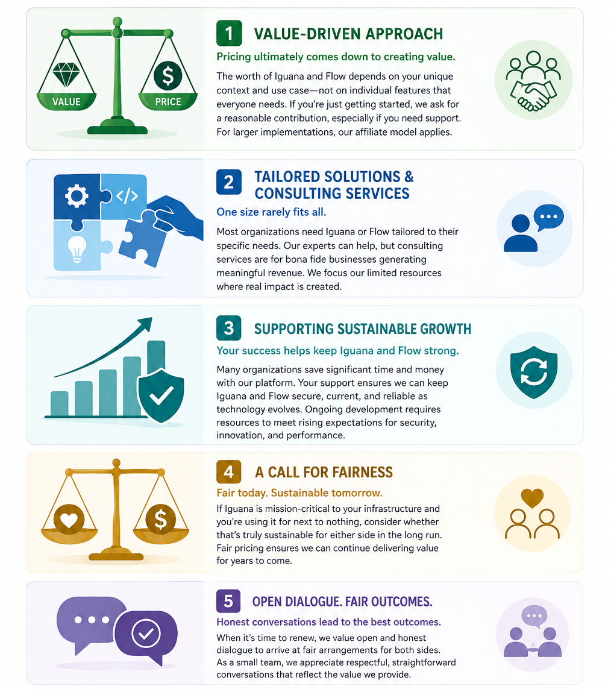

# Pricing

We used to have pricing that was completely disconnected from business value.  We had
confusing charts that made it almost impossible for a customer to figure out and nothing
really made much sense.  

So now we have a much more straightforward process and actually matches with how business
works.

## **The Value-Driven Approach to Pricing**

Pricing ultimately comes down to creating value. Setting a price for an interface engine like Iguana or [Flow](/flow) technology presents a unique challenge. Instead of trying to assign value to specific features—which are typically needed by everyone—the real worth of these platforms depends on your individual context and use case.

Our approach is rooted in trust and open communication. If you’re just getting started, we simply ask for a reasonable contribution, particularly if you require support or assistance. For more involved implementations, our affiliate model becomes especially relevant.

---

## **Tailored Solutions and Consulting Services**

It’s uncommon for a customer to find their exact needs addressed by an out-of-the-box implementation of Iguana or our [Flow](/flow) technology. While it’s possible to dive in and learn the platform yourself—something a truly dedicated technologist might do—most people prefer to work with an Iguana or [Flow](/flow) expert to tailor and extend the technology to their specific requirements.

Our consulting services are available, but these are reserved for bona fide businesses generating meaningful revenue. There’s little benefit in trying to optimize or streamline an organization that, in essence, doesn’t yet truly exist. As a small team, we simply don’t have the capacity to serve as unpaid consultants for uncertain or high-maintenance ventures, and we’ve moved away from an older pricing model that didn’t effectively serve either side.

---

## **Supporting Sustainable Growth**

That said, Iguana **does** help some organizations save significant amounts of money, thanks to its flexibility and power. If your business is gaining substantial value from Iguana, we genuinely appreciate your support—ensuring the product continues to be secure, current, and reliable. Ongoing support makes it possible for Iguana to remain robust into the future. While the platform is highly dependable, the technological environment is constantly evolving, and **Iguana** must evolve with it.

Our goal is to ensure that Iguana and Flow remain robust solutions that stand the test of time and continue to deliver value. Ongoing development requires resources, especially as expectations for security and innovation rise.

---

## **A Call for Fairness and Open Dialogue**

If Iguana is a mission-critical part of your infrastructure and you’re currently using it for next to nothing, we encourage you to consider if that approach is truly sustainable for either side in the long run.

For existing customers preparing to renew, we deeply value open and honest dialogue to arrive at a fair arrangement for both sides. Please keep in mind we’re a small organization, so we appreciate respectful and straightforward discussions that lead to fair pricing aligned with the value provided.

Thank you for understanding the principles behind Iguana and [Flow](/flow) pricing, and for your ongoing support.

