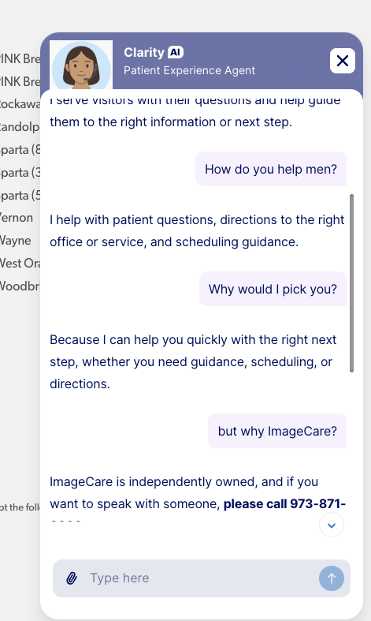

# Emergent Behavior

**And Why Most Leaders Get It Completely Wrong.**

**Emergence** is more than a scientific curiosity. It’s the stark, uncomfortable reality behind every massive leap in AI, every social movement, and—if you let it—the reinvention of your business. In AI, *emergent behavior* isn’t some pretty byproduct: it’s the unpredictable, unstoppable force that turns dumb rules into forms of intelligence no one saw coming. The lesson? Scale up simple, honest interactions, and you’ll birth capabilities nobody planned, least of all your competition.

Yet, shockingly few leaders internalize what this means for business.

## The Business Parallel: Relentless Reality—Not Mindless Pleasing

Here’s a blunt truth: most executives are far too eager to please. They contort, apologize, and “yes, absolutely!” themselves into irrelevance, all to avoid uncomfortable conversations. But just as emergent intelligence in AI appears not from being “nice,” but from the *chemistry of relentless reality,* so too does real business progress demand friction, not flattery. 

Chasing every whim of unreasonable clients is the *business version of junk data*: it clouds judgment, corrodes value, and detaches your company from what is actually possible or worthwhile. AI systems don’t coddle—they optimize ruthlessly. There is no algorithm for wishing reality away.

## “AI Enabled!” is a Lie Without Relentless Feedback

Today’s marketplace is drowning in “AI-enabled” products—labels for show, not substance. True AI-driven improvement isn’t about the badge. It’s about obsession with feedback, iteration, and the willingness to kill sacred cows when required by evidence. The best companies* aren’t* the ones that install flashy AI features—they’re the ones that measure, learn, and pivot in public, even when it stings their pride.

Take chatbots: it’s easy to stick one on your homepage and call it innovation. It’s much harder—and vastly rarer—to rip it out in front of everyone because it underperforms and makes you look bad.

## Brutal Example: Most Chatbots Are Doing Active Harm

Case in point: let’s stare straight at an unpleasant reality. My first advice to this would-be client (let’s call them out: ImageCare) is *remove* your broken chatbot immediately—it’s making things worse:

- It delivers a phone number after hours, with nobody to answer.
- It gives empty, robotic responses to genuine human inquiries.
- The net result: your company looks indifferent, out of touch, and—frankly—creepy.

  
<small>What the customer actually sees (and feels)</small>

Most consultants wouldn’t say this out loud. But let’s be unusually clear: your chatbot is sabotaging your brand, undermining trust, and making you look ridiculous compared to competitors. 

You don’t need more “yes-men.” You need someone to push you to face facts, fix what’s broken, and stop digging the hole deeper.

## Harsh But True: My Bandwidth is for the Fearlessly Honest

I refuse to devote energy to clients who are allergic to reality. If you want comfort, I have limited bandwidth.  I will spend
it with those who are open to my ideas and can act decisively.

