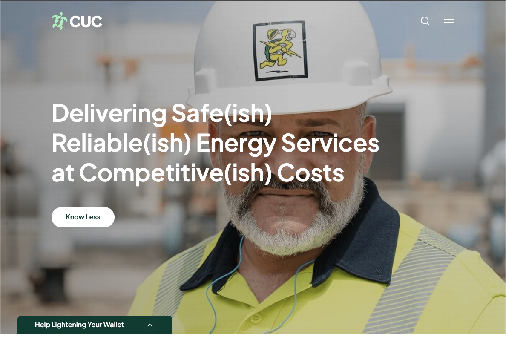

# Efficiency

Extreme efficiency can be very disruptive. I have a solar system in my place in the Cayman Islands, which supplies some of my electricity.

From the [Pareto Principle](/system/leverage/pareto) principle, I know that 80% of my power consumption comes from 20% of my house.

The air conditioning and pool pump are the things that consume electricity.

Now you'd think let's go and use traditional integration techniques to grab the relevant data and make it work.

Nah.

That's really expensive and would involve tricky electronics, costs, and risk.

That's not the [Theory of Constraints](/system/toc) way.  Instead, let's do it much less expensively.

We can just use cheap little computers called Raspberry Pis. These run Linux have an ARM processor. We can hook up cheap video cameras to them and just point them at the relevant systems and use a bit of scripting with Lua - ala [Flow Device](/flow/device) and there you have it: a 'good enough' integration that hasn't cost $100,000 in order to get cost savings of $500 for 16 years (knowing full well that the gear will have stopped working by then).

Now if I do it for my house and create an inexpensive 'recipe' for the rest of the island, which I give away as open source and have Caymanian affiliates go and do the actual work - thus saving me a whole load of paperwork. Then everyone's happy, saving a bunch of money on power (and water).

The only one who won't be happy will be [CUC Cayman](https://www.cuc-cayman.com/).

They will be distinctly unhappy when it ceases to be easy for them to maintain **"Delivering Safe Reliable Energy Services at Competitive Costs"**. Their costs will go up as their economies of scale reduce. At some point, they'll go bankrupt, which is an interesting aspect of network switching. That will be challenging for all those high-rise developments in the island.

I wouldn't shed any tears for CUC - it's crazy that an island with a huge amount of losses from global warming and rising sea levels contributes to the problem with inefficient centralized power generation largely using fossil fuels for delivery.

CUC has been one of the most effective forces in slowing down the adoption of solar energy in the Cayman Islands.

**Let them burn.**

The approach is more effective than ESG questionnaires. Solid engineering and appealing to people's real motivations to save a few bucks on their power bill.

Funny how 'improving' something creates unexpected system effects elsewhere, eh?

