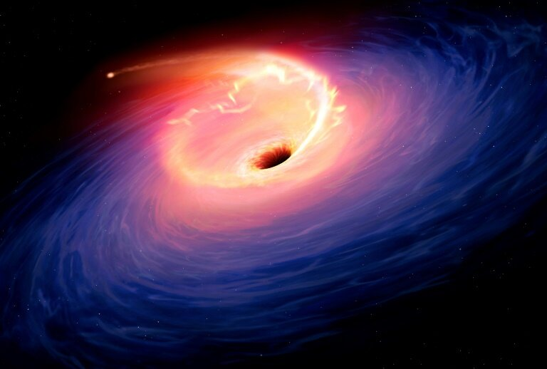

# Physics 

Newtonian mechanics are an exceptionally useful engineering tool, accurately describing the motion of everyday objects. But at the boundaries of experience—when we push to the extremes—these classic laws begin to break down, and new rules emerge.

## At Extreme Speed and Mass

For most everyday speeds and masses, Newton’s laws work perfectly well. However, as objects approach the speed of light or involve immense masses—such as those found near black holes—Newtonian physics is no longer adequate. Here, Einstein’s theory of relativity takes over, and space and time themselves begin to warp and stretch. The familiar rules of physics no longer apply; the universe behaves in unexpected ways.

## At the Extremely Small

Similarly, when we zoom into the tiny world of atoms and subatomic particles, classical mechanics loses its power. At these minuscule scales, quantum mechanics reigns. Uncertainty becomes inherent, probability is fundamental, and particles behave both as waves and as particles. Once again, the rules change dramatically.

