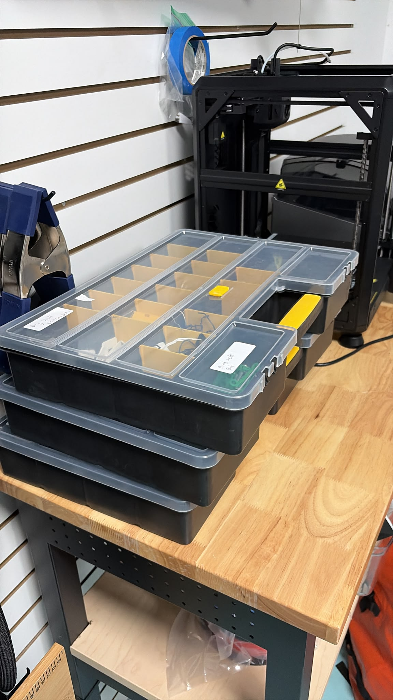

# Stackable

**Stackable similar storage containers are make organization easier**

This is an example of symmetry.

.

Getting the same standardized storage containers makes it easier to organize
the storage of your equipment and is key to keeping well organized.

These containers are better than the pokey fancy containers that manufacturers
have for screws and drill bits.

When you find a good product make sure you have a few ways of getting product
again.  Where I live the biggest hardware on island is notorious for being
inconsistent with their stock.  It's important to make sure you can get more
of the products you like.
