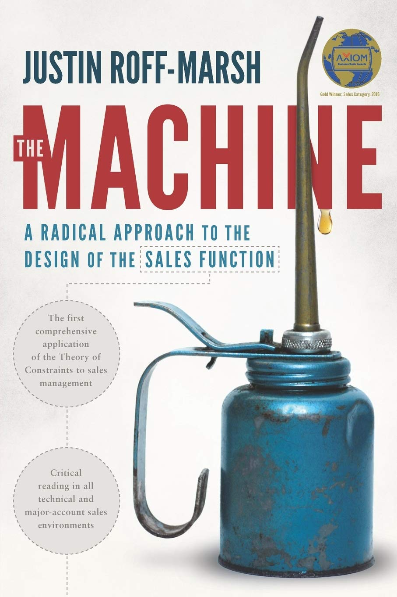

# The Machine

**This is a book by Justin Roff-Marsh**

## Controversial Idea

Justin Roff-Marsh describes how Eliyahu Goldratt's [Theory of Constraints](/system/toc) can be applied to the sales and marketing function.

I was in the audience at a Peerscale meeting—an organization in Canada filled with very conventional sales leaders—when Justin gave a talk about rebuilding the sales function using what I only later learned was the Theory of Constraints.

His talk caused a surprising emotional uproar among the many sales leaders present.

Personally, as a very rational and technical person who is deeply interested in ideas, I never felt entirely comfortable at Peerscale. The organization seemed very conventional in its thinking. When it came down to it, its members were more followers than leaders.

## But Fundamentally Correct

Justin's ideas were brilliant. Most sales leaders accept received wisdom without critically considering whether these ideas are actually true.

Let’s take one popular example of received "sales wisdom":

> There are hunters and farmers.

This is recited almost like a religious mantra. The idea is that prospecting for new accounts should be handled by a group called ‘hunters,’ while growing existing accounts should be left to the ‘farmers.’ Sadly, not everyone in sales is intellectually curious, and their thinking rarely goes any deeper.

But if you look more closely, this statement reflects just one special case of a broader systems principle: systems become simpler and more efficient through [the division of labor](/system/separate/labor). By separating concerns, you can make any system easier to manage and more effective.

Justin starts the book by proposing a theoretical scenario—a catastrophe in which the entire sales and marketing team perishes in a tragic accident. Perhaps that's why the sales leaders didn't appreciate his talk; maybe they took this idea personally.

Justin then outlines how an organization’s critical sales functions could be rebuilt from scratch.

After years of trying to get my sales leadership to implement these ideas, I realized that they would never willingly do so. So, I let them all go and actually simulated the event Justin describes in his book. It turned out brilliantly.

The Theory of Constraints truly works—you just need to be willing to [do uncomfortable things occasionally](/system/extreme) to apply it.

