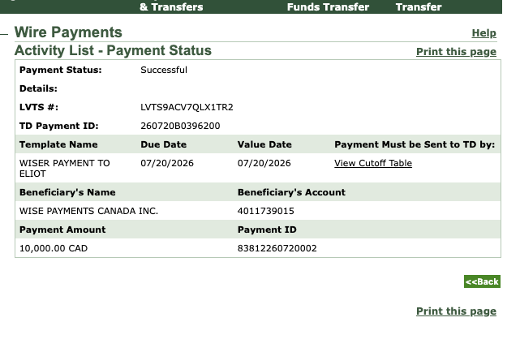

# Wise transfer problem

WISE have legendary awful customer service.  You always deal with
someone different and half the time it's not clear if you are dealing
with a poorly trained AI or a poorly trained human.  It doesn't make
much difference.

This support issue has been bounced so many times and I am always
losing the email with the information since no one seems to be able
to design an email client which doesn't lose email (thank you spammers - you don't make it easy to manage email.

```
Hello Sasha/Bob/Judy/Anonymous One,

The CAD $10,000.00 payment received by Wise on July 20, 2026 came directly from my company’s TD business account:

Account holder: iNTERFACEWARE INC.
Bank: TD Canada Trust
SWIFT: TDOMCATTTOR
Transit: 01096
Account: 5202159

TD identifies the successful payment as:

Beneficiary: WISE PAYMENTS CANADA INC.
Beneficiary Account: 4011739015
LVTS #: LVTS9ACV7QLX1TR2
TD Payment ID: 260720B0396200
Payment ID: 83812260720002

The issue is that I sent the funds directly from my business TD account to my personal Wise account. I subsequently learned that I should have transferred them through my personal TD account first.

I have attached the TD documentation identifying both the originating account and the payment. The originating account is documented as belonging to iNTERFACEWARE INC.

Please let me know if you require any specific additional documentation from TD to trace or verify this payment.

Regards,
Eliot Muir
```


