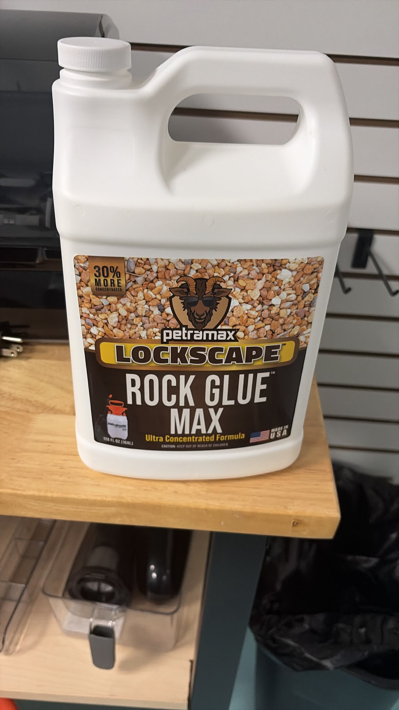

# Rock

 **Petramax Lockscape Rock Glue Max**  
*Specialized for gravel, stone, and landscaping use.*

## How it Helps with Gravel Paths

Loose gravel on paths can get kicked away or shift over time. Using a product like **Petramax Lockscape Rock Glue Max** gives you a way to "lock" loose stones in place—creating a **stable, walkable surface** while keeping a natural look.

It's a potential solution to eliminate a persistent maintenance issue in my home.

## How to Use Petramax on a Gravel Path

### Surface Preparation
- **Rake and Level:** Remove any leaves, dirt, or debris. Rake stones to roughly the final shape you want.
- **Dry Surface:** Make sure gravel is mostly dry for best bonding.

### Application Method
- **Pour/Spray:** Some adhesives are poured or sprayed directly over the gravel (check product instructions). For **Petramax Lockscape Rock Glue Max**, you can:
    - Apply via a squeeze bottle, caulking gun, or for large areas, by mixing and spreading.
- **Saturate:** Apply a generous but even coat over the gravel. Don’t puddle it—just enough to touch most stone surfaces.
- **Work in Sections:** Do small areas at a time for best control.

### Finishing & Curing
- **Lightly Press Down:** Tamping the gravel lightly (with a tamper or board) helps glue reach more stones.
- **Let Cure:** Initial set in minutes to an hour; allow **24 hours** for full strength before heavy use or rain.

## Benefits for Gravel Paths

- **Prevents Stones from Shifting:** Stones are glued in place, but the path keeps a natural, permeable appearance.
- **Reduces Kicked/Scattered Stones:** Especially useful for walkways, garden paths, or dog runs.
- **Weather Resistant:** Rain, sun, and cold won’t break down the bond once cured.
- **Low Maintenance:** No more regular raking or adding extra gravel.

## Tips & Notes

- **Longevity:** This is a **semi-permanent solution** and can last for years if done right.
- **Permeability:** Paths remain water-permeable (unlike solid concrete).
- **Repair:** If needed, fresh glue can be added to loose spots in the future.
- **Cleanup:** Use gloves and tools (like a roller or trowel) you can clean up right after or discard.

---

## Summary Table

| Feature                                    | Benefit                                                             |
|---------------------------------------------|---------------------------------------------------------------------|
| Bonds loose gravel                         | Stabilizes path; no more shifting or scattered rocks                |
| Weatherproof & durable                     | Withstands rain, freeze/thaw, sun                                   |
| Easy to use (for DIY and pros)             | Simple squeeze/pour/spread application, DIY-friendly                |
| Cures fast                                 | Walkable in 24 hours or less                                        |
| Looks natural                              | Maintains gravel’s look, texture, and drainage                      |
