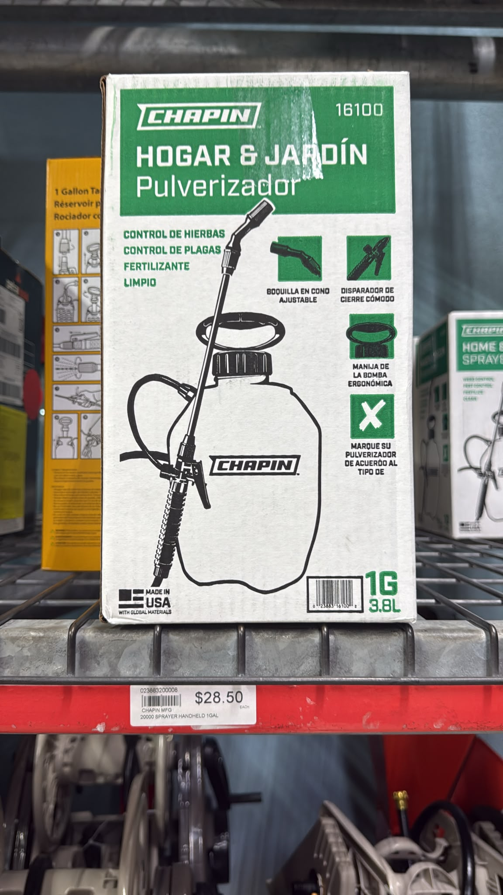

# Spray

Manufacturers will often recommend their own brands of tools as a way
of driving profit by charging more for a generic product.  This is
why you always benefit from understanding core concepts and not being
prone to manipulation by manufacturers.

Nothing is really that expensive.  All scarcity is manufactured in today's
world.

Rock glue is like that.  You can use a standard pressurized spray bottle.

Just remember to clean it afterwards.

Soap and water - do it immediately after using the product.

