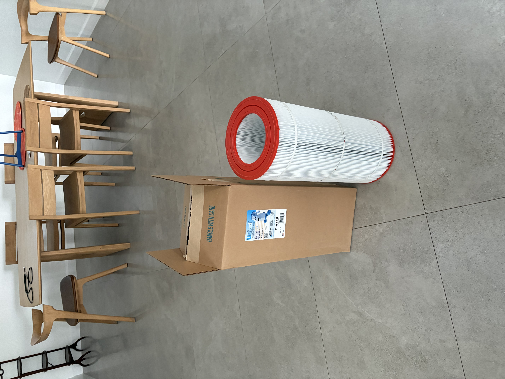

# Filter

**Filtering water is a key concept in managing water quality.**

Let’s return to the fundamental idea of systems. One effective way to improve a system is by considering what we [remove from it](/system/remove).

When it comes to water quality, various types of filters are used. Some are fine-grained and capable of removing very small particles and biological contaminants that you don’t want to drink, while others are coarser.

Maintaining and regularly checking filters is crucial for ensuring and improving water quality.

Where are your filters?  
When were they last checked?

The [power of two is a powerful concept](/system/two): having two filters allows you to cycle them—clean one and let it dry while deploying the other.

  

This the filter we got in Cayman.  It's really expensive.  $165 each after taxes in Cayman dollars.  Yes we do pay tax here.  It's in the price of what we buy.  We pay our taxes our way and we're not interested in paying your taxes your way. The manufacturer preaches the message that it's simply the best.

Well if the competition is 1/3 the price and you can change the filter more often it would be better?

Or what if it was made of a more durable more washable construction?  Then it would be less expensive
and not fill up landfills?

Filters are a concept used in many types of systems, including both physical and software systems.

For example, see [robot filters](/tconcepts/science/electrical/robot/filter). Everything is connected.

See the whole system.  
Understand everything
