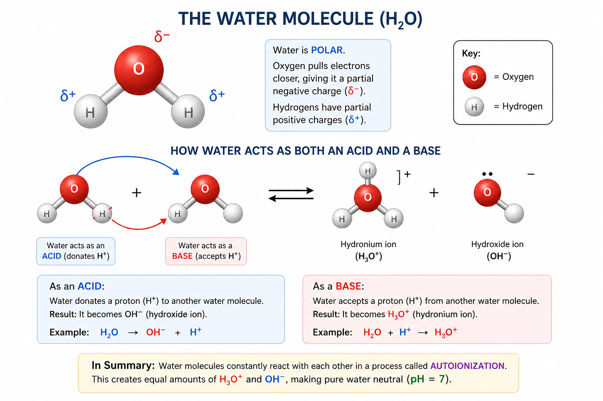

# H₂O

**Water consists of two hydrogen atoms connected to an oxygen atom.**

## Explanation

**Chemical Structure:**  
- The formula **H₂O** tells us that each molecule of water is made of two hydrogen (H) atoms bonded to one oxygen (O) atom.
- The atoms are arranged so the molecule has a "bent" shape, not a straight line.

## Why This is Important for Acids and Bases

### **Water as a Solvent**
- Water is known as the "universal solvent" because it dissolves many substances, including acids and bases.
- Most acid-base chemistry happens in water!

### **Water Self-Ionizes**
- Water can **ionize** a little bit, splitting into hydrogen ions (H⁺, often called protons) and hydroxide ions (OH⁻):

### **Defining Acids and Bases**
- **Acids** are substances that increase the concentration of H⁺ (or H₃O⁺) in water.
- **Bases** increase the concentration of OH⁻ in water.
- The **pH scale**, which tells us how acidic/basic a solution is, is based on the concentration of H⁺ in water.

### **Amphoteric Nature**
- Water can **act as both an acid and a base** (amphoteric). 
  - As a [base](/tconcepts/science/chemistry/base): Accepts a proton (H⁺)
  - As an [acid](/tconcepts/science/chemistry/acid): Donates a proton (H⁺)

### **Buffering and Reactions**
- Many chemical reactions involving acids and bases depend on water's structure and ability to donate/accept H⁺.

---

### Summary

**Significance:**  
Water’s unique structure (two hydrogens bonded to one oxygen) makes it the perfect environment for acid-base reactions, lets it self-ionize, and gives it the ability to act as both an acid and a base. All of this is foundational to understanding acid-base chemistry!

If you want to know more, or see how water participates in specific acid-base reactions, let me know

