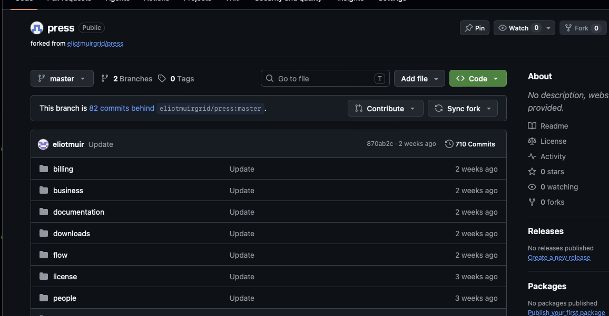
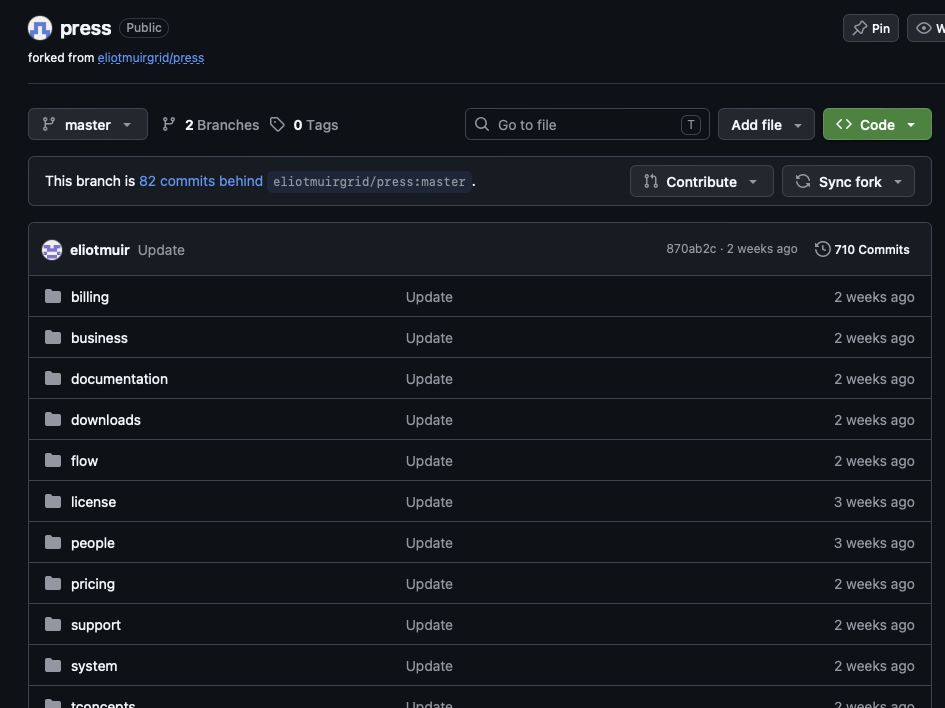
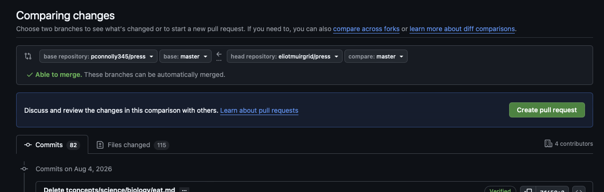
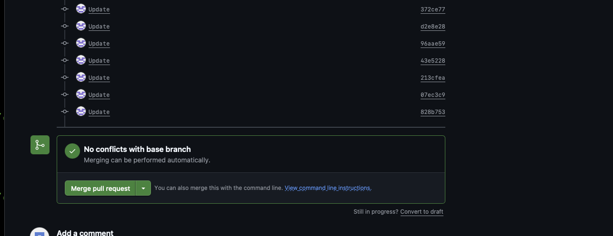

# Update

How do you update a fork if you want to stay up to date 
with the changes made since your forked a repository?

There are 5 steps in the GUI

There are 5 steps in the GUI.

## Step 1

You should see something that indicates your fork is behind the original repository.

Click **Sync fork**.

## Step 2

Click **Contribute**, then **Open pull request**.

## Step 3

GitHub will show the changes between the two repositories.

Check that:

* **base repository** is your fork
* **base** is `master`
* **head repository** is the original repository
* **compare** is `master`

You should see **Able to merge**.

Click **Create pull request**.

## Step 4

GitHub will create the pull request.

You should see **No conflicts with base branch**.

Click **Merge pull request**.

## Step 5

I forgot to get a screenshot for this step.

Click **Confirm merge**.

Your fork should now contain the latest changes from the original repository.

