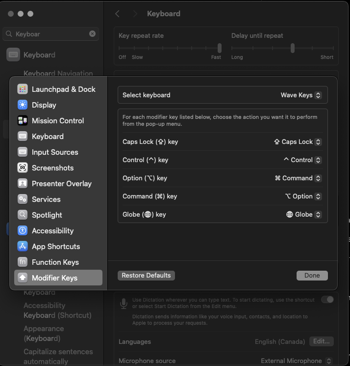

# Map

Did you know you can remap keys in your keyboard using most operating systems?

Sometimes this is necessary.  Perhaps the manufacturer got the key mapping
wrong.

Like for my Logi Wave keyboard the Apple Command key was mapped to the wrong
key.  That was really hurting my productivity - it was a [bottleneck](/system/toc/bottleneck) that was physically painful.

As you can see these are easily swapped.
